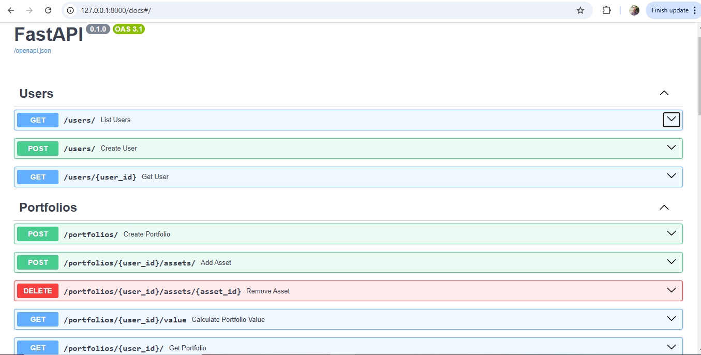
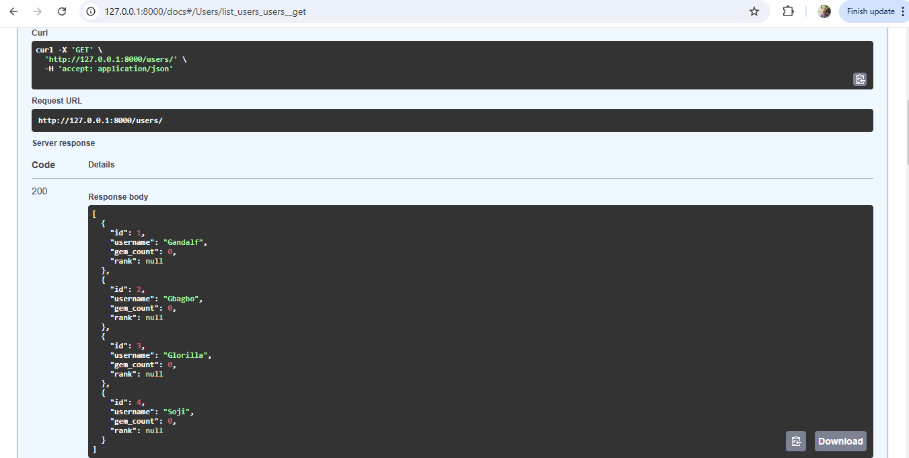
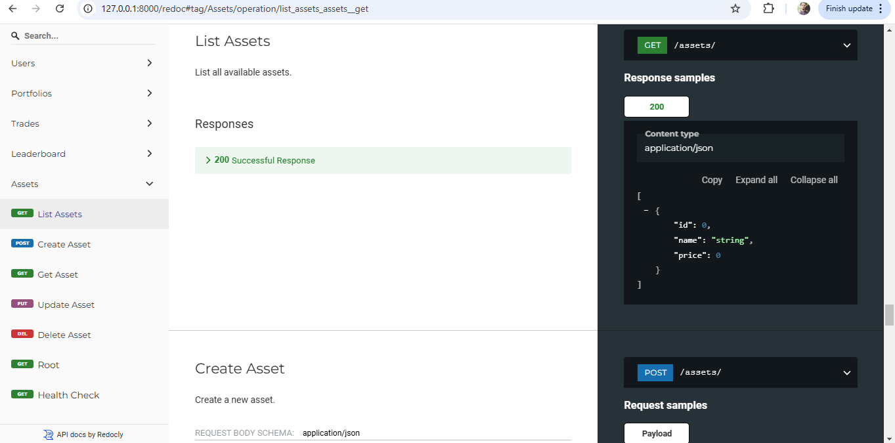
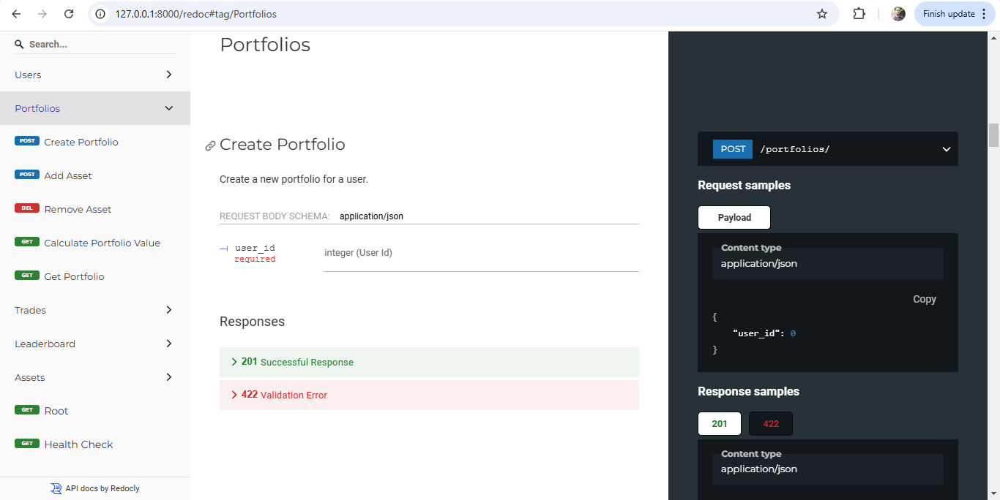
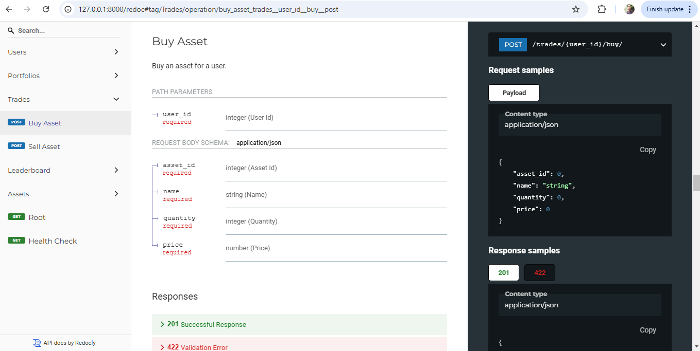
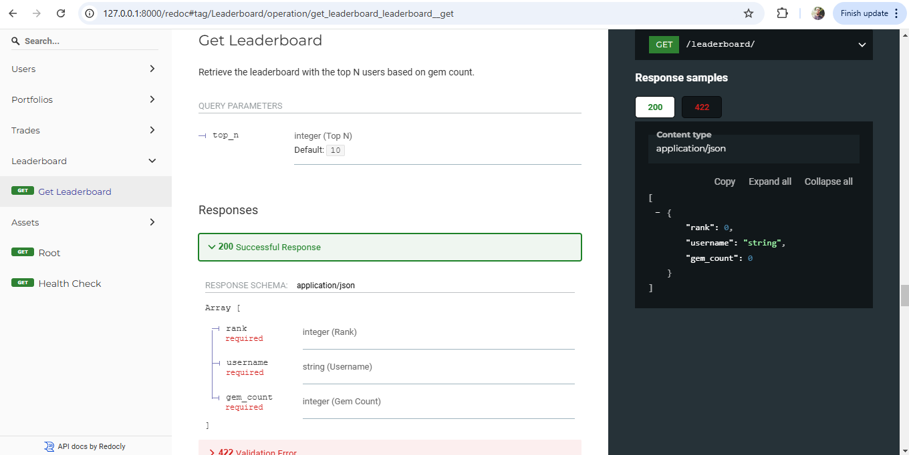

# Gamified Trading System

[](https://github.com/uche-madu/gamified_trading_system/actions/workflows/ci.yml) [](https://codecov.io/gh/uche-madu/gamified_trading_system)


## Overview

The **Gamified Trading System** is a backend API application designed to simulate asset trading in a gamified environment. Users can create portfolios, buy and sell assets, and track their progress through a leaderboard based on trading milestones and achievements. The system provides APIs for managing users, assets, portfolios, trades, and rankings.

The backend is built with **FastAPI** for high-performance API development and **SQLAlchemy** for database interactions. Swagger UI is available for exploring and interacting with the API endpoints.

This project emphasizes modularity, scalability, and maintainability, with comprehensive testing implemented using **pytest**.

---



## Functionality

### 1. **Users**
- Users can be created with unique IDs and usernames.
- User information includes attributes such as:
  - `id`: Unique identifier.
  - `username`: User's name.
  - `gem_count`: Number of gems earned through trading milestones.
  - `rank`: User's rank based on their gem count.

### 2. **Assets**
- Assets represent tradeable items (e.g., stocks, commodities).
- Each asset has:
  - `id`: Unique identifier.
  - `name`: Name of the asset (e.g., "Gold", "Silver").
  - `price`: Price of the asset.

#### Supported Operations:
- **Create an Asset**: Add new assets to the system.
- **Retrieve an Asset**: Get details of a specific asset.
- **Update an Asset**: Modify asset name or price.
- **Delete an Asset**: Remove an asset from the system.
- **List All Assets**: Retrieve all available assets.

### 3. **Portfolios**
- A portfolio is associated with a user and contains the assets they own.
- **Portfolio Assets** include:
  - `asset_id`: ID of the asset.
  - `name`: Name of the asset.
  - `quantity`: Number of units owned.
  - `price`: Price at the time of adding to the portfolio.

#### Supported Operations:
- **Create a Portfolio**: Initialize a portfolio for a user.
- **Add Asset to Portfolio**: Add or update an asset in the user's portfolio.
- **Remove Asset from Portfolio**: Reduce or remove an asset from the portfolio.
- **List Portfolio Assets**: Retrieve all assets in the user's portfolio.
- **Calculate Portfolio Value**: Compute the total value of a portfolio based on current asset prices.

### 4. **Trades**
- Users can **buy** and **sell** assets, which updates their portfolio and trading milestones.
- Trade operations include:
  - **Buy Asset**: Add new or increase existing assets in the portfolio.
  - **Sell Asset**: Reduce or remove assets from the portfolio.

#### Response Includes:
- A confirmation message detailing:
  - Quantity of the asset traded.
  - Asset name.
  - Price at which the trade was executed.
  - Total value of the transaction.

### 5. **Leaderboard**
- Users are ranked based on their **gem count**, which increases as they trade assets and achieve milestones.
- Ranks are dynamically assigned after every trade operation.

#### Supported Operations:
- **Retrieve Leaderboard**: List the top `N` users sorted by their gem count.

---

## Key Features

- **Gamification**: Users earn gems based on trading milestones:
  - 1 gem per trade.
  - Bonus gems for achieving milestones like 5 and 10 trades.
- **Dynamic Rankings**: Leaderboard ranks users in real time based on gem count.
- **Portfolio Management**: Users can view, add, update, and delete assets within their portfolios.
- **Asset Management**: Admins can manage assets by adding, updating, or removing them.
- **Robust Testing**: Comprehensive test suite using `pytest` ensures reliability of services and routes.
- **Scalable Architecture**: Built using FastAPI, SQLAlchemy, and Docker, ensuring modularity and scalability.

---

## API Endpoints

### **Users**
| Method | Endpoint              | Description                       |
|--------|-----------------------|-----------------------------------|
| GET    | `/users/{user_id}`    | Retrieve a user's information.   |
| POST   | `/users/`             | Create a new user.               |
| GET    | `/users/`             | List all users.                  |



### **Assets**
| Method | Endpoint              | Description                       |
|--------|-----------------------|-----------------------------------|
| POST   | `/assets/`            | Create a new asset.              |
| GET    | `/assets/{asset_id}`  | Retrieve an asset by ID.         |
| PUT    | `/assets/{asset_id}`  | Update asset details.            |
| DELETE | `/assets/{asset_id}`  | Delete an asset.                 |
| GET    | `/assets/`            | List all assets.                 |



### **Portfolios**
| Method | Endpoint                          | Description                                |
|--------|-----------------------------------|--------------------------------------------|
| POST   | `/portfolios/{user_id}`           | Create a portfolio for a user.             |
| POST   | `/portfolios/{user_id}/assets/`   | Add an asset to the portfolio.             |
| DELETE | `/portfolios/{user_id}/assets/`   | Remove an asset from the portfolio.        |
| GET    | `/portfolios/{user_id}/assets/`   | List all assets in a portfolio.            |
| GET    | `/portfolios/{user_id}/value`     | Calculate the portfolio's total value.     |



### **Trades**
| Method | Endpoint                     | Description                   |
|--------|------------------------------|-------------------------------|
| POST   | `/trades/{user_id}/buy/`     | Buy an asset.                 |
| POST   | `/trades/{user_id}/sell/`    | Sell an asset.                |



### **Leaderboard**
| Method | Endpoint              | Description                           |
|--------|-----------------------|---------------------------------------|
| GET    | `/leaderboard/`       | Retrieve the top-ranked users.        |


---

## Tech Stack

- **FastAPI**: Backend framework for high-performance APIs.
- **SQLAlchemy**: ORM for database interactions.
- **Pydantic**: Schema validation and data parsing.
- **PostgreSQL**: Relational database for data persistence.
- **Docker**: Containerization for deployment.
- **Pytest**: Testing framework for unit and integration tests.

---

## Testing

Comprehensive tests are written for:
1. **Services**: Ensures correctness of business logic.
2. **Routes**: Validates API endpoints and responses.
3. **Edge Cases**: Handles scenarios like missing resources or invalid inputs.

Run the test suite with:

```bash
pytest tests/
```

## How to Run the Project

### **1. Local Setup (Development Environment)**

To run the project locally on your machine:

#### Prerequisites:
- Python 3.12+
- PostgreSQL installed locally
- Virtual Environment (`venv`)

#### Steps:
1. **Clone the Repository**:
    ```bash
    git clone git@github.com:uche-madu/gamified_trading_system.git
    cd gamified_trading_system
    ```

2. **Set Up a Virtual Environment**:

    ```bash
    python -m venv .venv
    source .venv/bin/activate
3. **Install Dependencies**:

    ```bash
    pip install --upgrade pip
    pip install -r requirements.txt
    ```
4. **Install the Project as a Local Library**:

    ```bash
    pip install -e .
    ```
5. **Set Up Environment Variables**: Create a `.env` file in the root directory with the following content:

    ```bash
    POSTGRES_USER=admin
    POSTGRES_PASSWORD=yourpassword
    POSTGRES_DB=gamified_trading
    POSTGRES_HOST=localhost
    POSTGRES_PORT=5432
    ```
This assumes you've already setup your postgres database locally with these variables.

6. **Run the Application**: Start the FastAPI development server:

    ```bash
    uvicorn app.main:app --reload
    ```
7. **Access the API**:

- Visit the API documentation at: http://localhost:8000/docs
### **2. Run Using Docker Compose**
To run the project with Docker Compose, follow these steps:

**Prerequisites**:
- Docker
- Docker Compose

**Steps**:
1. **Clone the Repository**:

    ```bash
    git clone git@github.com:uche-madu/gamified_trading_system.git
    cd gamified_trading_system
    ```
2. **Set Up Environment Variables**: Create a `.env` file in the root directory with the following content:

    ```bash
    POSTGRES_USER=admin
    POSTGRES_PASSWORD=yourpassword
    POSTGRES_DB=gamified_trading
    POSTGRES_HOST=postgres
    POSTGRES_PORT=5432
    ```
3. **Start the Services**: Run Docker Compose to start PostgreSQL and the FastAPI application:

    ```bash
    docker compose up -d --build
    ```
4. **Verify the Services**:

- Check FastAPI: [http://localhost:8000/docs](http://localhost:8000/docs)
- PostgreSQL is exposed on port `5432`.
5. **Stop the Services**: To stop the services run:

    ```bash
    docker compose down
    ```
---

### **3. Running Tests**
You can run the test suite using `pytest`:

    ```bash
    pytest app/tests --disable-warnings
    ```
If using Docker, you can run tests inside the container (ensure the services are running):

    ```bash
    docker exec -it gamified_trading_fastapi pytest app/tests --disable-warnings
    ```
**Notes**:
- The `pip install -e .` step ensures your project is installed as an editable package.
- Docker Compose streamlines deployment by combining PostgreSQL and the FastAPI backend.


## API Documentation

You can explore the API using the following documentation pages generated by **FastAPI**:

1. **Swagger UI** (Interactive API Documentation):
   - Visit: [http://localhost:8000/docs](http://localhost:8000/docs)

2. **ReDoc** (Alternative API Documentation):
   - Visit: [http://localhost:8000/redoc](http://localhost:8000/redoc)

Both pages allow you to view all available endpoints, input/output schemas, and test the API directly (Swagger UI only).
